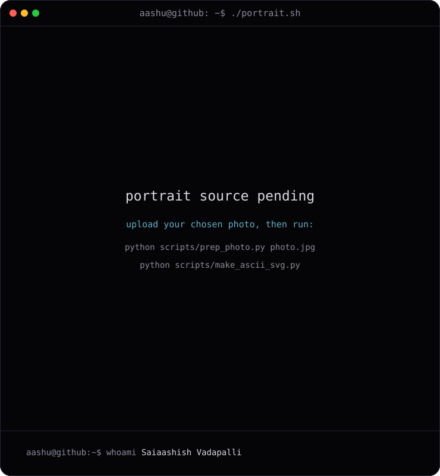

<div align="center">

<h3><code>aashu@github ~ $ whoami</code></h3>

<table>
<tr>
<td valign="top"></td>
<td valign="top"></td>
</tr>
</table>

<br><br>

<h3><code>aashu@github ~ $ ./contributions.sh</code></h3>


<br><br>

<h3><code>aashu@github ~ $ ./links.sh</code></h3>

<b>Software Engineering · AI/ML · Cloud Security</b>

<br><br>

<a href="https://aashu-github.github.io/"></a>
<a href="https://www.linkedin.com/in/s-vadapalli/"></a>
<a href="mailto:vaashu108@gmail.com"></a>

</div>

---

## About

I am a **Computer Science student at The University of Texas at Dallas**, graduating in **May 2028**, building across software engineering, AI/ML, cloud security, backend development, and secure system design.

My engineering approach is product-focused: turn ambiguous requirements into maintainable systems, separate complex applications into understandable layers, validate performance with measurable evidence, and design security into the development lifecycle instead of adding it afterward.

Current work includes **AI-native security evaluation**, **cloud-cost optimization**, **Spring Boot REST APIs**, and **machine-learning prediction pipelines**.

### Open To

- Software Engineering internships and co-ops
- Backend and API engineering opportunities
- Cloud security and DevSecOps roles
- AI/ML engineering and model-evaluation projects
- Open-source collaboration on developer and security tooling

---

## Tech Stack

### Languages

<div align="center">

[](https://skillicons.dev)


</div>

### Frontend

<div align="center">

[](https://skillicons.dev)

</div>

### Backend & Databases

<div align="center">

[](https://skillicons.dev)

<br>


</div>

### Cloud, DevOps & Security

<div align="center">

[](https://skillicons.dev)

<br>


</div>

---

## Featured Projects

<details open>
<summary><strong>CloudSpend — Automated AWS Cost Visualizer & Optimizer</strong></summary>

<br>

A local-first AWS FinOps tool that ingests infrastructure, utilization, and cost data and turns it into explainable savings recommendations.

| Category | Details |
| :-- | :-- |
| **What it solves** | Helps teams identify cloud waste such as idle compute, rightsizing opportunities, scheduling candidates, orphaned EBS volumes, and cost anomalies |
| **How it works** | Demo fixtures, uploaded files, and read-only live AWS scans all normalize into the same canonical model before deterministic optimization rules run |
| **Stack** | Python, Flask, Boto3, Pandas, Pydantic, SQLAlchemy, SQLite, Plotly.js, Pytest, Moto, GitHub Pages |
| **Security** | Read-only MVP, secure ZIP ingestion controls, explicit evidence/provenance, partial-failure handling, and no automatic infrastructure mutation |
| **Repository** | [View on GitHub](https://github.com/Aashu-Github/CloudSpend) · [Live Demo](https://aashu-github.github.io/CloudSpend/) |

</details>

<br>

<details>
<summary><strong>XSignOn AI-Native Security Testing & Governance Evaluation</strong></summary>

<br>

A modular, six-layer framework for adversarial testing, governance mapping, security evaluation, evidence management, and risk reporting across AI systems.

| Category | Details |
| :-- | :-- |
| **What it solves** | Makes AI red-team testing, guardrail evaluation, model-quality checks, and governance evidence repeatable instead of fragmented across separate tools |
| **How it works** | Moves from target abstraction through offensive testing, guardrails, evaluation, governance crosswalking, and evidence-based reporting |
| **Stack** | Python, Docker, Kubernetes, Ollama, Garak, Promptfoo, PyRIT, DeepEval, RAGAS |
| **Security** | Covers prompt injection, data leakage, model extraction, API abuse, guardrail enforcement, and vulnerability classification |
| **Repository** | [View on GitHub](https://github.com/Aashu-Github/XsignOn-AI-Native-Security-Testing---Governance-Mapped-Evaluation) |

</details>

<br>

<details>
<summary><strong>NBA Playoff Game Predictor</strong></summary>

<br>

An end-to-end machine-learning pipeline that predicts NBA playoff game outcomes using historical team-performance data and engineered matchup features.

| Category | Details |
| :-- | :-- |
| **What it solves** | Converts raw historical team statistics into matchup probabilities rather than relying on simple win/loss comparisons |
| **How it works** | Engineers differential features, trains on earlier seasons, evaluates on newer seasons, and exposes predictions through a CLI |
| **Stack** | Python, Pandas, scikit-learn, nba_api, Matplotlib, Joblib |
| **Validation** | Uses temporal splitting to reduce future-data leakage and includes model-diagnostic visualizations |
| **Repository** | [View on GitHub](https://github.com/Aashu-Github/nba-playoff-predictor) · [Live Site](https://aashu-github.github.io/nba-playoff-predictor/) |

</details>

<br>

<details>
<summary><strong>Task Manager REST API</strong></summary>

<br>

A production-structured RESTful task-management service built with Java and Spring Boot.

| Category | Details |
| :-- | :-- |
| **What it solves** | Provides a clean backend foundation for task CRUD, filtering, status management, priority management, and keyword search |
| **How it works** | Separates controllers, business logic, persistence, and domain models with centralized exception handling and repository-backed data access |
| **Stack** | Java 17, Spring Boot 3, Spring MVC, Spring Data JPA, H2, Maven, JUnit 5 |
| **Extensibility** | Structured to add JWT authentication, RBAC, PostgreSQL, and containerized deployment |
| **Repository** | [View on GitHub](https://github.com/Aashu-Github/task-manager-api) |

</details>

<br>

<details>
<summary><strong>FitAI — AI-Powered Meal Planning Application</strong></summary>

<br>

A collaborative full-stack application for recipe discovery, recommendations, recipe details, filtering, and meal-planning workflows.

| Category | Details |
| :-- | :-- |
| **What it solves** | Reduces the friction of finding and organizing meal options through searchable, persistent application workflows |
| **How it works** | Uses a three-tier structure across Flask routes, services, and repositories with a seeded local database and frontend integration |
| **Stack** | Python, Flask, SQLite, HTML, CSS, JavaScript |
| **Team** | Built in a five-person development workflow with isolated branches and defined ownership areas |
| **Repository** | [View on GitHub](https://github.com/Aashu-Github/fitai) |

</details>

---

## Experience

### AI Intern — XSignOn
**May 2026 – August 2026**

- Developed components of a six-layer AI red-team architecture spanning target abstraction, offensive testing, guardrails, evaluation, governance crosswalking, and evidence reporting.
- Integrated Garak, Promptfoo, and PyRIT into adversarial-testing workflows and developed scoring/verdict pipelines for normalized findings.
- Built containerized guardrail testing for prompt injection, secret leakage, and pre/post-inference enforcement decisions.
- Integrated DeepEval and RAGAS for correctness, groundedness, safety, robustness, regression testing, and threshold-based quality gates.
- Designed evaluation workloads for reproducible Docker and Kubernetes execution.

`Python` `Docker` `Kubernetes` `Ollama` `Garak` `Promptfoo` `PyRIT` `DeepEval` `RAGAS` `AI Security` `OWASP LLM Top 10`

### Software Developer — Autonomous Systems Research, Nova Labs Research Lab
**August 2025 – December 2025**

- Extended a C++ mapping workflow with global-map ingestion and performance-focused data processing.
- Improved point-cloud handling through separate close- and long-range strategies and reduced blind-spot false positives on large datasets.
- Built and maintained CI/CD and sensor-data ingestion workflows for LiDAR and camera outputs.
- Used code review, regression testing, and structured debugging to keep changes stable across collaborative merges.

`C++` `SLAM` `LiDAR` `Point Clouds` `CI/CD` `Git` `Regression Testing` `Agile/Scrum`

### Outreach Officer — Theta Tau, Kappa Zeta Chapter
**2025 – Present**

- Lead external outreach and partnership development for a professional engineering organization at UT Dallas.
- Coordinate company/community outreach, event support, sponsorship messaging, and cross-functional chapter initiatives.

`Leadership` `Partnership Development` `Technical Communication` `Event Planning` `Team Collaboration`

---

## Achievements & Certifications

<div align="center">


</div>

- **Academic Performance:** 3.74/4.00 GPA in B.S. Computer Science
- **Engineering Leadership:** Outreach Officer, Theta Tau at UT Dallas
- **Applied ML:** Built an end-to-end playoff prediction pipeline using multi-season data
- **Cloud / Security:** Hands-on work across distributed systems, secure SDLC, AI evaluation, and cloud-security tooling

---

## Current Focus

```yaml
learning:
  - Advanced backend architecture
  - Secure cloud infrastructure and DevSecOps
  - Machine-learning evaluation and model reliability
  - AI security testing and governance frameworks

building:
  - Cloud cost optimization and FinOps tooling
  - AI-native security evaluation services
  - Production-structured REST APIs
  - Applied machine-learning projects

exploring:
  - Enterprise AI orchestration
  - Agent and model interaction testing
  - Control-plane and data-plane architecture
  - Distributed systems and secure cloud platforms

open_to:
  - Software engineering internships
  - Backend engineering roles
  - Cloud security and DevSecOps opportunities
  - AI/ML engineering and evaluation projects

graduation: "May 2028"
```

---

## Connect

<div align="center">

<a href="mailto:vaashu108@gmail.com"></a>
<a href="https://www.linkedin.com/in/s-vadapalli/"></a>
<a href="https://github.com/Aashu-Github"></a>
<a href="https://aashu-github.github.io/"></a>

<br><br>

### `Build systems that are useful, measurable, and secure by design.`

</div>
